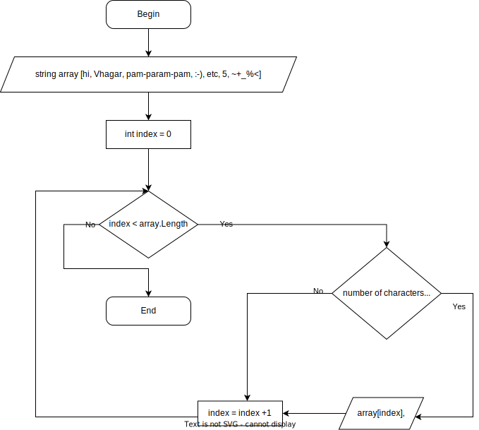

# Текстовое описание решения

1. В первой строке задан массив.
2. Во второй строке заданный массив выводится на консоль, чтобы иметь возможность проверить работу программы.
3. В третьей строке введено название функции и в неё передан массив.
4. С пятой по пятнадцатую строчку расположена сама  функция. Функция носит название FindThreeCharactersElement и служит для нахождения в массиве всех элементов, состоящих из трёх символов и менее.

## Описание функции

* функция с ключевым словом void, так как возвращать результат не потребуется;
* на седьмой строке идёт вывод текста на консоль, несёт в основном эстетическую функцию, также удобно отделяет изначальный массив от того, что доллжен получиться;
* на восьмой строке запускается цикл, который должен прокрутить весь массив;
* на десятой строке, в теле цикла, расположен оператор if, проверяющий количество символов в текущем элементе массива, оно должно быть меньше или равно трём;
* на двенадцатой строке расположен вывод на консоль подходящего по требованию элемента массива, срабатывает в случае положительного ответа оператора if.